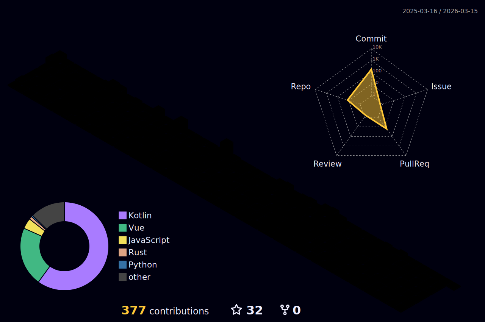

<h1 style="text-align: center">Привет мир!</h1>


## Познакомимся?)
Меня зовут Игорь, я программист из России.
Занимаюсь программированием чуть больше 3-х лет, посвящаю этому делу все свободное время.
Люблю шахматы и котиков :3

Вы можете сделать заказ в моем [телеграмм канале](https://t.me/kingchev_works)

## Навыки и знания
<picture>
  <source media="(prefers-color-scheme: dark)" srcset="https://raw.githubusercontent.com/kiNgchev/kiNgchev/output/github-contribution-grid-snake-dark.svg">
  <source media="(prefers-color-scheme: light)" srcset="https://raw.githubusercontent.com/kiNgchev/kiNgchev/output/github-contribution-grid-snake.svg">
  
</picture>

### Языки: 


 \


### Фреймворки: 


### Сервисы: 


 \


### IDE:


## Мои контакты:
- Discord: [_kingchev](https://discord.com/users/743878110747033691)
- Telegram: [kiNgchev Hub](https://t.me/k1ngchev), [kiNgchev works](https://t.me/kingchev_works)
- Twitch: [k1ngchev](https://www.twitch.tv/k1ngchev)
- Youtube: [KiNgchev Hub](https://www.youtube.com/channel/UC1-4OolMyPyZPJguuztT87Q)
- X: [kiNgchev](https://x.com/TheKiNgchev)
- Bio: [Website](https://kingchev.net/)

## Статистика

<!--START_SECTION:waka-->


**🐱 My GitHub Data** 

> 📦 257.8 kB Used in GitHub's Storage 
 > 
> 🏆 238 Contributions in the Year 2025
 > 
> 🚫 Not Opted to Hire
 > 
> 📜 20 Public Repositories 
 > 
> 🔑 20 Private Repositories 
 > 
**I'm a Night 🦉** 

```text
🌞 Morning                20 commits          █░░░░░░░░░░░░░░░░░░░░░░░░   04.76 % 
🌆 Daytime                130 commits         ████████░░░░░░░░░░░░░░░░░   30.95 % 
🌃 Evening                233 commits         ██████████████░░░░░░░░░░░   55.48 % 
🌙 Night                  37 commits          ██░░░░░░░░░░░░░░░░░░░░░░░   08.81 % 
```
📅 **I'm Most Productive on Sunday** 

```text
Monday                   59 commits          ████░░░░░░░░░░░░░░░░░░░░░   14.05 % 
Tuesday                  56 commits          ███░░░░░░░░░░░░░░░░░░░░░░   13.33 % 
Wednesday                39 commits          ██░░░░░░░░░░░░░░░░░░░░░░░   09.29 % 
Thursday                 62 commits          ████░░░░░░░░░░░░░░░░░░░░░   14.76 % 
Friday                   48 commits          ███░░░░░░░░░░░░░░░░░░░░░░   11.43 % 
Saturday                 57 commits          ███░░░░░░░░░░░░░░░░░░░░░░   13.57 % 
Sunday                   99 commits          ██████░░░░░░░░░░░░░░░░░░░   23.57 % 
```


📊 **This Week I Spent My Time On** 

```text
🕑︎ Time Zone: Europe/Moscow

💬 Programming Languages: 
No Activity Tracked This Week

🔥 Editors: 
No Activity Tracked This Week

🐱‍💻 Projects: 
No Activity Tracked This Week

💻 Operating System: 
No Activity Tracked This Week
```

**I Mostly Code in Kotlin** 

```text
Kotlin                   20 repos            █████████████░░░░░░░░░░░░   52.63 % 
HTML                     3 repos             ██░░░░░░░░░░░░░░░░░░░░░░░   07.89 % 
JavaScript               2 repos             █░░░░░░░░░░░░░░░░░░░░░░░░   05.26 % 
CSS                      1 repo              █░░░░░░░░░░░░░░░░░░░░░░░░   02.63 % 
Vue                      1 repo              █░░░░░░░░░░░░░░░░░░░░░░░░   02.63 % 
```


**Timeline**


 Last Updated on 19/08/2025 17:20:03 UTC
<!--END_SECTION:waka-->

## Donate
<a align="center" href=https://www.donationalerts.com/r/kingchev>
    
</a> 