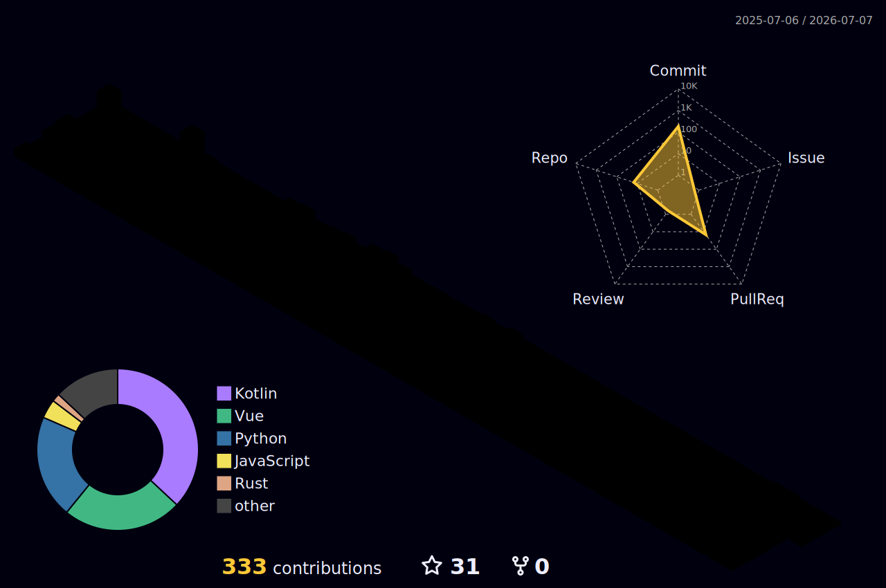

<h1 style="text-align: center">Привет мир!</h1>


<p align="center">
  
</p>

## Познакомимся?)
Меня зовут Игорь, я программист из России.
Занимаюсь программированием чуть больше 3-х лет, посвящаю этому делу все свободное время.
Люблю шахматы и котиков :3

Вы можете сделать заказ в моем [телеграмм канале](https://t.me/kingchev_works)

## Навыки и знания
<picture>
  <source media="(prefers-color-scheme: dark)" srcset="https://raw.githubusercontent.com/kiNgchev/kiNgchev/output/github-contribution-grid-snake-dark.svg">
  <source media="(prefers-color-scheme: light)" srcset="https://raw.githubusercontent.com/kiNgchev/kiNgchev/output/github-contribution-grid-snake.svg">
  
</picture>

### Языки: 


 \


### Фреймворки: 


### Сервисы: 


 \


### IDE:


## Мои контакты:
- Discord: [_kingchev](https://discord.com/users/743878110747033691)
- Telegram: [kiNgchev Hub](https://t.me/k1ngchev), [kiNgchev works](https://t.me/kingchev_works)
- Twitch: [k1ngchev](https://www.twitch.tv/k1ngchev)
- Youtube: [KiNgchev Hub](https://www.youtube.com/channel/UC1-4OolMyPyZPJguuztT87Q)
- X: [kiNgchev](https://x.com/TheKiNgchev)
- Bio: [Website](https://kingchev.net/)

## Статистика

<!--START_SECTION:waka-->


**🐱 My GitHub Data** 

> 📦 299.3 kB Used in GitHub's Storage 
 > 
> 🏆 102 Contributions in the Year 2026
 > 
> 🚫 Not Opted to Hire
 > 
> 📜 30 Public Repositories 
 > 
> 🔑 19 Private Repositories 
 > 
**I'm a Night 🦉** 

```text
🌞 Morning                49 commits          ██░░░░░░░░░░░░░░░░░░░░░░░   06.33 % 
🌆 Daytime                199 commits         ██████░░░░░░░░░░░░░░░░░░░   25.71 % 
🌃 Evening                429 commits         ██████████████░░░░░░░░░░░   55.43 % 
🌙 Night                  97 commits          ███░░░░░░░░░░░░░░░░░░░░░░   12.53 % 
```
📅 **I'm Most Productive on Sunday** 

```text
Monday                   90 commits          ███░░░░░░░░░░░░░░░░░░░░░░   11.63 % 
Tuesday                  121 commits         ████░░░░░░░░░░░░░░░░░░░░░   15.63 % 
Wednesday                103 commits         ███░░░░░░░░░░░░░░░░░░░░░░   13.31 % 
Thursday                 91 commits          ███░░░░░░░░░░░░░░░░░░░░░░   11.76 % 
Friday                   107 commits         ███░░░░░░░░░░░░░░░░░░░░░░   13.82 % 
Saturday                 114 commits         ████░░░░░░░░░░░░░░░░░░░░░   14.73 % 
Sunday                   148 commits         █████░░░░░░░░░░░░░░░░░░░░   19.12 % 
```


📊 **This Week I Spent My Time On** 

```text
🕑︎ Time Zone: Europe/Moscow

💬 Programming Languages: 
Kotlin                   1 hr 40 mins        ██████░░░░░░░░░░░░░░░░░░░   25.30 % 
YAML                     1 hr 33 mins        ██████░░░░░░░░░░░░░░░░░░░   23.63 % 
Rust                     49 mins             ███░░░░░░░░░░░░░░░░░░░░░░   12.39 % 
TOML                     40 mins             ███░░░░░░░░░░░░░░░░░░░░░░   10.18 % 
Python                   23 mins             █░░░░░░░░░░░░░░░░░░░░░░░░   05.87 % 

🔥 Editors: 
IntelliJ IDEA            6 hrs 34 mins       █████████████████████████   99.28 % 
Unknown Editor           2 mins              ░░░░░░░░░░░░░░░░░░░░░░░░░   00.72 % 

🐱‍💻 Projects: 
Projekt-Mastodont        3 hrs 38 mins       ██████████████░░░░░░░░░░░   55.06 % 
k-os                     1 hr 26 mins        █████░░░░░░░░░░░░░░░░░░░░   21.68 % 
sj-backend               1 hr 5 mins         ████░░░░░░░░░░░░░░░░░░░░░   16.57 % 
bio-remaster             16 mins             █░░░░░░░░░░░░░░░░░░░░░░░░   04.24 % 
frontend                 7 mins              ░░░░░░░░░░░░░░░░░░░░░░░░░   01.84 % 

💻 Operating System: 
Windows                  6 hrs 36 mins       █████████████████████████   100.00 % 
```

**I Mostly Code in Kotlin** 

```text
Kotlin                   23 repos            ██████████░░░░░░░░░░░░░░░   41.07 % 
Python                   10 repos            ████░░░░░░░░░░░░░░░░░░░░░   17.86 % 
Vue                      2 repos             █░░░░░░░░░░░░░░░░░░░░░░░░   03.57 % 
Rust                     1 repo              ░░░░░░░░░░░░░░░░░░░░░░░░░   01.79 % 
C++                      1 repo              ░░░░░░░░░░░░░░░░░░░░░░░░░   01.79 % 
```


**Timeline**


 Last Updated on 19/06/2026 18:58:00 UTC
<!--END_SECTION:waka-->

## Donate
<a align="center" href=https://www.donationalerts.com/r/kingchev>
    
</a> 
